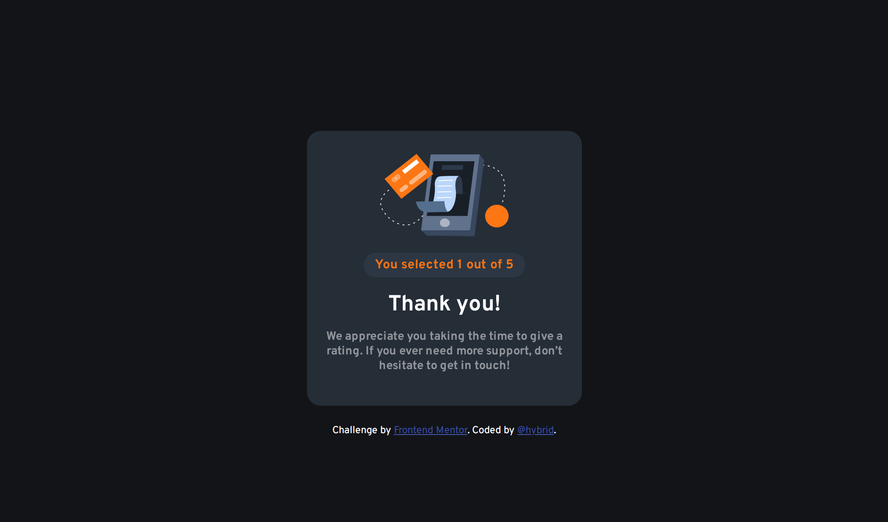

# Frontend Mentor - Interactive rating component solution

This is a solution to the [Interactive rating component challenge on Frontend Mentor](https://www.frontendmentor.io/challenges/interactive-rating-component-koxpeBUmI). Frontend Mentor challenges help you improve your coding skills by building realistic projects. 

## Table of contents

- [Overview](#overview)
  - [The challenge](#the-challenge)
  - [Screenshot](#screenshot)
  - [Links](#links)
  - [Built with](#built-with)
  - [What I learned](#what-i-learned)
  - [Continued development](#continued-development)
  - [Useful resources](#useful-resources)
- [Author](#author)
- [Acknowledgments](#acknowledgments)

## Overview

### The challenge

Users should be able to:

- View the optimal layout for the app depending on their device's screen size
- See hover states for all interactive elements on the page
- Select and submit a number rating
- See the "Thank you" card state after submitting a rating

### Screenshot


### Links

- Solution URL: [Add solution URL here](https://your-solution-url.com)
- Live Site URL: [Add live site URL here](https://your-live-site-url.com)

### Built with

- Semantic HTML5 markup
- CSS custom properties
- Mobile-first workflow
- Vanilla Javascript

### What I learned

I learn more about the css transform property and got to experiment on more on the radio input type by tweaking it with javascript.

```css
.card{
    position: absolute;
    height: 100%;
    width: 100%;
    transform-style: preserve-3d;
    transition: all 0.5s ease;
}
```
```js
for (let i = 0; i < options.length; i++) {
    submitButton.addEventListener('click',() => {
        if (options[i].checked) {
            flipCard.style.transform = 'rotateY(180deg)';
            ratingSummary.innerHTML = 'You selected ' + options[i].value + ' out of 5';  
        }else {
            errorMessage.style.display='block';
        }
    });   
    
     
};
```

### Continued development

I hope to keep working input management based projects for me to be get full grasp on the concept.

### Useful resources

- [Youtube](https://www.youtube.com/watch?v=OV8MVmtgmoY) - This helped me for card flipping effect. I really liked this pattern and will use it going forward.
- [Youtube](https://www.youtube.com/watch?v=GDh9uToZkYg) - This helped me for the rating selector. I really liked this pattern and will use it going forward.

## Author

- Frontend Mentor - [@Michaelhybrid](https://www.frontendmentor.io/profile/Michaelhybrid)
- Twitter - [@micheal_olu99](https://twitter.com/micheal_olu99)

## Acknowledgments

To God be the glory.